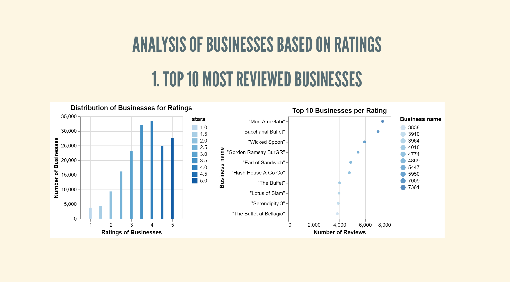
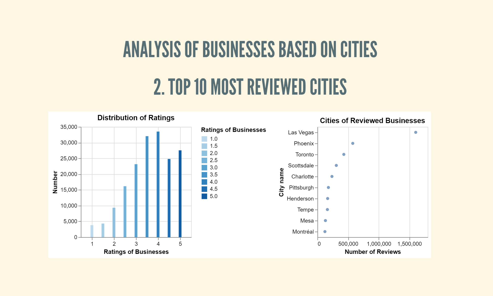
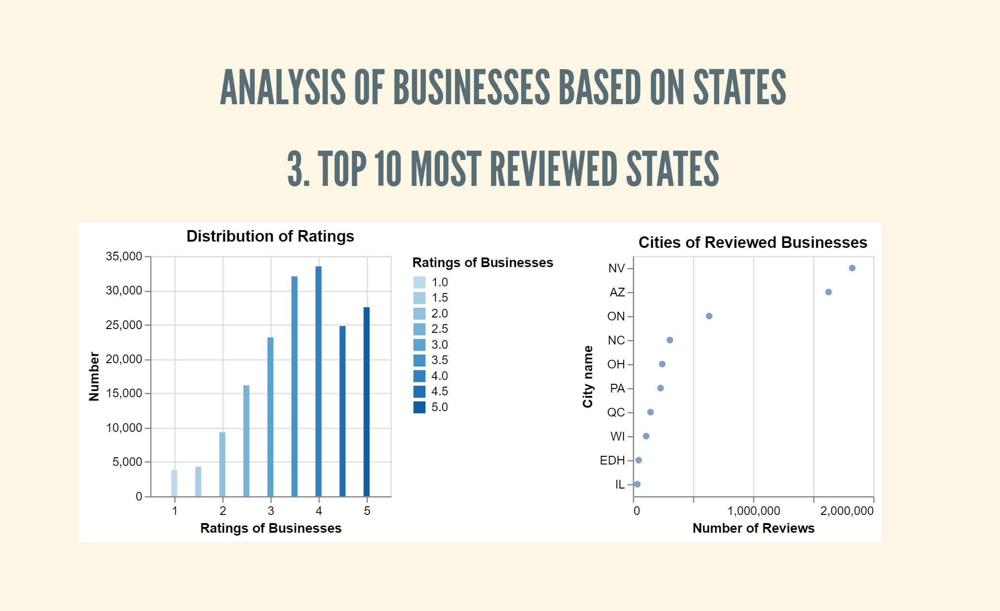

# Yelp Dataset Visualization

This project includes the code for the visualization of Yelp Business Dataset.

The web presentation an be accessed using this [link:](https://hrgupta.github.io/yelp-dataset-visualization)

It shows the top restaurants in the Yelp Dataset using three parameters.

* Ratings
* Cities
* States

For each of these parameters these are the output visualizations.

## Top restaurants based on ratings

The below graph shows top 10 most reviewed businesses.

## Top reviewed cities

This graph shows top 10 most reviewed cities.

## Top reviewed states

The graph below shows top 10 most reviewed states.

